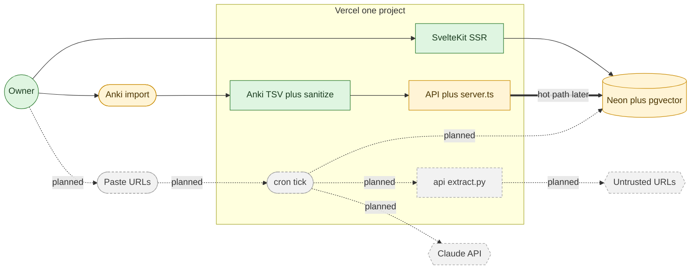

# Overhaul report

Phase 0 of the Remediate cut. This file is the brief for a reviewer who did not write the change. The product vision stays in PRD, TDD, and PIPELINE. This file records what this PR actually did, what it measured, and what it left open.

| | |
|---|---|
| **Scope** | Cut the FastAPI and Neo4j service, promote the SvelteKit app to the repo root, land the Anki parser plus sanitizer plus Drizzle schema |
| **Tests** | Parser ground truth Confirmed by `npx tsx` against `source_data/`: 320 + 137 = 457 records, 457 unique GUIDs. Vitest runner still red. See Open. |
| **Verified** | Parser and sanitizer by a TypeScript probe, not by `yarn test:server`. CI lint and typecheck were not run to completion on this branch. |
| **Risk** | Vercel Root Directory must move from `frontend` to `.` before the next production deploy, or the build looks for a directory that no longer exists |
| **Breaks** | Anyone cloning into the old `frontend/` or `backend/` layout. Anyone relying on the `deploy-backend` job, `docker-compose.yml`, or Neo4j |
| **Reversible** | Revert is clean. No database was migrated. No GitHub repo rename. |
| **Open** | Vitest 5 `describe` throws `Cannot read properties of undefined (reading 'config')` on a bare config. Storybook cut. Neon not provisioned. |

## What this is

The repo described a FastAPI plus Neo4j plus spaCy system that the TDD already retired. Dependabot kept opening PRs against that fiction: 11 pip alerts on `backend/` and 3 Docker Action bumps that existed only to feed `deploy-backend`. This PR deletes the retired service, promotes the SvelteKit app to the root, and lands the two modules the pipeline says block Phases 3 through 6: the Anki TSV parser and the HTML sanitizer.

Python stays as a language. The FastAPI service goes. The one Python file the TDD keeps, `api/extract.py`, is not in this PR. It lands in Phase 4 with the SSRF guard.

## The new shape

Status is a separate channel from kind. Green and a solid border means built in this PR or already on main. Amber means a scaffold exists. Grey, a dashed border, and a `planned` edge label means it does not exist yet.

VS Code built-in preview shows the fence as a code block. The Markdown Preview Mermaid Support extension renders it. GitHub renders it natively on the PR.

| Status | Meaning |
|---|---|
| Built | In this PR, or already on main |
| Partial | A scaffold or schema exists. No live data, no user flow |
| Planned | Not started. Drawn so the next agent does not treat absence as accidental |

### Boundary: browser to Vercel

The user hits one origin. SvelteKit `+server.ts` routes are the API. A second HTTP service would add a second auth boundary and a hop inside our own app. That is why `backend/` is gone.

### Boundary: cron to extract.py

BMX fetches arbitrary user-supplied URLs. That is SSRF by construction. The extractor is a separate runtime with a shared internal token and no database credentials. A compromise there reaches the internet, not Neon. The file is not in this PR. The isolation is why the service was deleted instead of trimmed.

### Boundary: app to Neon

Every table carries `user_id` on the row so Phase 1 can attach RLS without a join. The schema is code only. No migration has been applied. `DATABASE_URL` is unset.

## What was cut

| Gone | Why |
|---|---|
| `backend/` | FastAPI plus spaCy, NLTK, sklearn, pandas, neo4j, yake. 318 lines of Python pulling a tree Dependabot would never finish bumping |
| `schema.graphql` | No GraphQL server existed. The contract had already drifted |
| `docker-compose.yml` plus `scripts/dc_*` | Production is `git push` to Vercel. The compose file described Neo4j 5.15, APOC, and spaCy model volumes |
| `deploy-backend` job | SSH into a host and `docker-compose up`. That topology is retired |
| Dependabot `pip` and `docker` ecosystems on `/backend` | No manifests left to bump |
| Eight stale docs | They described Neo4j, FastAPI, Gemini, and a 1-day MVP that the TDD supersedes |
| `source_data/anki_importer.cypher` and the Neo4j Bloom zip | Historical artifacts of a graph store that was never implemented |
| Storybook plus its demo stories | Zero product stories. Addon set was Storybook 8 against a Storybook 10 core. The TDD said keep it because it was "already configured". That premise was false |
| `X-XSS-Protection` | SEC-8. Deprecated. The filter was itself an XSS vector |

## What was added

| Added | Why |
|---|---|
| `src/lib/server/ingest/anki-tsv.ts` | RFC4180 TSV. Columns from the preamble. Tags split on whitespace. Deck names containing `/` stay flat |
| `src/lib/server/ingest/sanitize.ts` | Allowlist sanitize at ingest. `javascript:` hrefs stripped. Surviving links get `rel="noopener noreferrer"` |
| `src/lib/server/ingest/identity.ts` | URL-safe id from SHA-256 of the GUID. Raw GUID never in a path or in markup |
| `src/lib/server/db/schema.ts` | TDD §4 tables: node, edge, review_state, review_log, harvest, quest_run, job. `user.username` restored so the existing auth scaffold typechecks |
| `csv-parse` 7.0.2 and `isomorphic-dompurify` 4.2.0 | Parser and sanitizer. Both older than 72 hours at install |
| `yarn.lock` at the repo root | It was gitignored. CI used `yarn install \|\| yarn install` and then auto-committed the lockfile. That is gone |

## Parser measurement

Confirmed by running the parser against the real files, not by trusting the test runner.

| File | Raw lines | Records | Unique GUIDs | Multiline backs | Hostile GUIDs |
|---|---:|---:|---:|---:|---:|
| Anthro | 4053 | 320 | 320 | 123 | 166 |
| CompSci | 576 | 137 | 137 | 23 | 70 |
| Total | 4629 | **457** | **457** | | 236 |

Both decks kept their `/`. Every notetype is `Basic`. Zero parser warnings. Every derived id matches `^[A-Za-z0-9_-]{16}$`.

Anthro has 123 multiline backs, not the 23 the TDD quoted for CompSci alone. CompSci matches the TDD: 23. The 123 figure is new measurement. It does not change the 457-record gate.

## Deviations from the TDD keep-list

1. **Storybook removed.** TDD §12.2 said keep it. The installed tree mixed Storybook 8 addons with Storybook 10, and there were no product stories after the demo kit was deleted. It returns in Phase 3 with real Cards components, one version.
2. **`frontend/` promoted in this PR.** PIPELINE Phase 0 called for it. Vercel Root Directory must change by hand before the next deploy.
3. **GitHub repo not renamed.** In-repo strings now say Remediate. `BMX` stays as the harvest subsystem name. The GitHub and Vercel project renames are yours.

## What a follow-up must not redo

- Do not restore `backend/`, Neo4j, spaCy, NLTK, FastAPI, or a second HTTP service.
- Do not `sed` `source_data/`. `articles.csv` and `ArticleMetadata.db` contain URLs and identifiers that match `BMX`.
- Do not add Next.js or React.
- Do not call Anthropic from this branch. No key is set.
- Do not treat the Drizzle schema as migrated. It is types plus table definitions.
- Do not close this as "tests pass" until `yarn test:server` is green. The 457 count is real. The Vitest runner is not.

## Next

1. Fix the Vitest runner or replace `yarn test:server` with a runner that loads `describe`.
2. Change the Vercel project Root Directory to `.`.
3. Close the Dependabot PRs whose manifests this PR deletes, if they are still open.
4. Phase 1: Neon, RLS, `withTenant`.
5. Phase 4: `api/extract.py` plus the SSRF tests.
