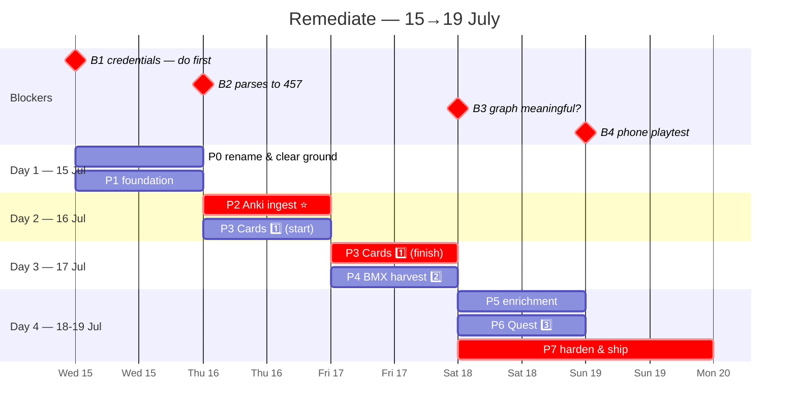

# Remediate — Development & Implementation Pipeline

**Status:** Draft v2 · **Date:** 2026-07-15 · **Target:** working prototype by 2026-07-19
**Companion docs:** [PRD.md](./PRD.md) (what & why) · [TDD.md](./TDD.md) (how)

> **v2 changes:** rename folded into Phase 0 · **Cards (P3) now explicitly precedes Quest (P6)** · BMX harvest is its own phase (P4) · B3 risk gate reframed (density resolved, meaningfulness still open) · Fable brief updated with the parser and GUID traps.

This document is the **execution plan**. It separates what a human must do from what an LLM can do, and marks every point where work stops until something unblocks it. Written to be re-read mid-project by a person or a model with no memory of the last session.

---

## Table of Contents

1. [The Pipeline](#1-the-pipeline)
2. [How to read the diagram](#2-how-to-read-the-diagram)
3. [Blockers](#3-blockers)
4. [Phases in detail](#4-phases-in-detail)
5. [The 4-day plan](#5-the-4-day-plan)
6. [Division of labour: why these lanes](#6-division-of-labour-why-these-lanes)
7. [Prompting Fable: the one-shot brief](#7-prompting-fable-the-one-shot-brief)
8. [Definition of done](#8-definition-of-done)

---

## 1. The Pipeline

**Build order: Anki ingest → Cards → BMX harvest → enrichment → Quest.** Cards is the Anki-like interaction surface and it comes first; it is also the only phase that is a complete product on its own.

```mermaid
flowchart TB
    START(["🚀 Start"]) --> P0

    subgraph P0["PHASE 0 — Rename & clear the ground"]
        direction TB
        H01["👤 Approve deletions + rename"]:::human
        B0{{"🚧 <b>B0</b> — no code until<br/>stack + rename approved"}}:::blocker
        H02["👤 GitHub: rename repo<br/>→ remediate.app<br/>(GH redirects old URLs)"]:::human
        L01["🤖 git remote set-url<br/>+ scoped find/replace<br/>(NOT source_data/)"]:::llm
        L02["🤖 Delete backend/ · Neo4j<br/>schema.graphql · prod compose"]:::llm
        L03["🤖 frontend/ → root<br/>rewrite README · write ADRs"]:::llm
        H01 --> B0 --> H02 --> L01 --> L02 --> L03
    end

    subgraph P1["PHASE 1 — Foundation"]
        direction TB
        H11["👤 Provision Neon<br/>via Vercel Marketplace"]:::human
        H12["👤 Set DATABASE_URL ·<br/>ANTHROPIC_API_KEY · INTERNAL_TOKEN"]:::human
        B1{{"🚧 <b>B1</b> — credentials.<br/>Human-only. Blocks everything."}}:::blocker
        L11["🤖 Drizzle schema (TDD §4)"]:::llm
        L12["🤖 Migrations: pgvector ·<br/>HNSW · RLS policies"]:::llm
        L13["🤖 withTenant() + RLS<br/>negative tests"]:::llm
        L14["🤖 Auth: oslo + argon2id"]:::llm
        H11 --> B1
        H12 --> B1
        B1 --> L11 --> L12 --> L13 --> L14
    end

    subgraph P2["PHASE 2 — Anki ingest ⭐ critical path"]
        direction TB
        L21["🤖 sanitize.ts + 100% tests<br/>(a href protocol allowlist)"]:::llm
        L22["🤖 anki-tsv.ts — RFC4180,<br/>preamble-driven cols, GUID id"]:::llm
        L23["🤖 POST /api/import → 202"]:::llm
        B2{{"🚧 <b>B2</b> — must parse to exactly<br/>320 + 137 = 457 records"}}:::blocker
        H21["👤 Verify: 457 cards, 2 decks,<br/>tags split on space, no XSS"]:::human
        L21 --> L22 --> L23 --> B2 --> H21
    end

    subgraph P3["PHASE 3 — Cards 1️⃣ (shippable alone)"]
        direction TB
        L31["🤖 srs/scheduler.ts<br/>+ property tests"]:::llm
        L32["🤖 /api/review/queue<br/>+ /api/review/grade"]:::llm
        L33["🤖 Study UI — 4-button,<br/>interval preview, keyboard"]:::llm
        L34["🤖 Deck browser · editor · stats"]:::llm
        H31["👤 Study 20 real cards.<br/>Does it feel like Anki?"]:::human
        L31 --> L32 --> L33 --> L34 --> H31
    end

    subgraph P4["PHASE 4 — BMX harvest 2️⃣"]
        direction TB
        L41["🤖 ssrf.ts + api/extract.py<br/>+ 100% guard tests"]:::llm
        L42["🤖 normalize-url · dedupe<br/>(url + content hash)"]:::llm
        L43["🤖 Tiered extract:<br/>full / metadata / failed"]:::llm
        L44["🤖 Constrained triage<br/>(enum from user's decks/tags)"]:::llm
        L45["🤖 Triage review queue UI"]:::llm
        H41["👤 Paste 20 mixed URLs<br/>incl. WSJ + apple.news.<br/>All 20 land? Tiered right?"]:::human
        L41 --> L42 --> L43 --> L44 --> L45 --> H41
    end

    subgraph P5["PHASE 5 — Enrichment"]
        direction TB
        L51["🤖 ai/guard.ts — isolation<br/>+ token budget ledger"]:::llm
        L52["🤖 ai/enrich.ts — chunk 8k,<br/>batch, structured, cached"]:::llm
        L53["🤖 Cron worker<br/>SKIP LOCKED"]:::llm
        L54["🤖 similar_to + prereq_of"]:::llm
        B3{{"🚧 <b>B3</b> — 🔴 <b>RISK GATE</b><br/>Is the graph <i>meaningful</i>?<br/>Human reads 20 edges."}}:::risk
        H51["👤 Read 20 AI edges.<br/>Sensible, or all 'both about brains'?"]:::human
        L51 --> L52 --> L53 --> L54 --> B3 --> H51
    end

    subgraph P6["PHASE 6 — Quest 3️⃣"]
        direction TB
        L61["🤖 quest/engine.ts — pure<br/>+ table tests"]:::llm
        L62["🤖 /api/quest/room + /move"]:::llm
        L63["🤖 Quest UI — 360px,<br/>44px targets, thumb-reach"]:::llm
        L64["🤖 Anonymous /play<br/>capped, no LLM"]:::llm
        H61["👤 <b>Playtest on a phone.</b><br/>Tune θ. Is it fun?"]:::human
        L61 --> L62 --> L63 --> L64 --> H61
    end

    subgraph P7["PHASE 7 — Harden & ship"]
        direction TB
        L71["🤖 CSP nonce · drop<br/>X-XSS-Protection"]:::llm
        L72["🤖 Rate limit · per-domain<br/>politeness"]:::llm
        L73["🤖 E2E: the 9 criteria"]:::llm
        L74["🤖 CI: typecheck·lint·test·e2e"]:::llm
        H71["👤 Deploy remediate.app.<br/>securityheaders.com = A"]:::human
        L71 --> L72 --> L73 --> L74 --> H71
    end

    P0 --> P1 --> P2 --> P3
    P3 --> P4 --> P5 --> P6
    P3 --> P7
    P6 --> P7
    P7 --> DONE(["🏁 Prototype"])

    SHIP{{"⛑️ Cut line: if time runs out,<br/>ship <b>P3 + P7</b>.<br/>Cards alone is a real product.<br/>Quest alone is not."}}:::risk
    P3 -.-> SHIP -.-> DONE

    classDef human fill:#1e3a5f,stroke:#4a90d9,stroke-width:2px,color:#e8f1fa
    classDef llm fill:#2d1f3d,stroke:#9d6bc4,color:#f0e8fa
    classDef blocker fill:#3d2d1f,stroke:#d99a4a,stroke-width:3px,color:#faf0e8
    classDef risk fill:#3d1f1f,stroke:#d94a4a,stroke-width:3px,color:#fae8e8
```



---

## 2. How to read the diagram

| Symbol | Meaning |
|---|---|
| 👤 **Blue** | **Human only.** Requires credentials, taste, judgment, or a physical device. An LLM *cannot* do these — not "shouldn't." |
| 🤖 **Purple** | **LLM.** Specified well enough in PRD/TDD to be generated. A human reviews the diff but doesn't write it. |
| 🚧 **Amber** | **Blocker.** Downstream work does not start. Not a checkpoint you wave through. |
| 🔴 **Red** | **Risk gate / cut line.** The answer may change the plan. |

**The dependency shape matters:**

- **P3 (Cards) depends only on P2.** It ships without P4, P5, or P6.
- **P4 (BMX) depends on P2** for the graph schema, not on P3.
- **P6 (Quest) depends on P5**, which depends on P4-or-P2 for content.
- **P7 (ship) can follow P3 directly** — that's the cut line.

That asymmetry is the safety margin in a 4-day build. Cards → ship is always reachable.

---

## 3. Blockers

| ID | Blocker | Who clears | Blocks | Why it's real |
|---|---|---|---|---|
| **B0** | Stack + rename approval | 👤 | Everything | Deleting `backend/` and renaming the repo are opinionated and semi-irreversible. [TDD §3.1](./TDD.md#31-python-the-honest-answer) argues the Python call; you have to actually agree. Don't let a model delete a service you might want. |
| **B1** | Neon provisioned + secrets set | 👤 | P1→P7 | An LLM cannot click a marketplace signup or hold a secret. **Do this before reading anything else** — ~3 minutes, gates literally everything. |
| **B2** | Real exports parse to **exactly 457** | 👤 | P3, P4, P5, P6 | The parser trap is the highest-probability silent bug in the build ([TDD §5.1](./TDD.md#51-the-trap-measured)). 4,629 lines → 457 records. A line-based parser produces plausible garbage and **does not error**. Everything downstream inherits it. Count with your eyes. |
| **B3** | 🔴 **Is the graph *meaningful*?** | 👤 | P6 (Quest) | Density is no longer the worry — 457 cards + 3,861 bookmarks ≈ 4,300 nodes, growing. But 8 neighbours at 0.82 cosine may all be "both about the brain": true and useless. Only a human can judge that. |
| **B4** | Playtest on an actual phone | 👤 | Ship | QST-5 and PRD Q2 are taste calls. "Is the door gate satisfying or punishing?" has no unit test. |

> **The sequencing decision:** enrichment (P5) precedes Quest (P6) despite Quest being the exciting part, purely to hit **B3** early. Building a beautiful Quest UI on a graph that turns out to be a hairball is the most expensive mistake available here — and the one that feels most natural to make.
>
> **The other sequencing decision (new in v2):** Cards (P3) precedes BMX (P4) and Quest (P6). Cards is the surface you'll use daily, it's the Anki-parity bar, and it's the only phase that's a product alone.

---

## 4. Phases in detail

### Phase 0 — Rename & clear the ground

**Goal:** the repo has the right name and stops describing a system that doesn't exist.

| Task | Lane | Notes |
|---|---|---|
| Approve deletions + rename | 👤 | 🚧 **B0** |
| **GitHub Settings → Rename** → `remediate.app` | 👤 | **Do this first.** GitHub permanently redirects old clone URLs and web links, so nothing breaks. This is what makes the rename safe. |
| `git remote set-url origin …/remediate.app.git` | 🤖 | |
| Scoped find/replace | 🤖 | ⚠️ **Never `sed -i` the repo.** `grep -ril bmx` matches `source_data/articles.csv`, `ArticleMetadata.db`, and a `.png` — replacing there corrupts fixtures. Exclude `source_data/**` and binaries ([TDD §12.1](./TDD.md#121-the-rename-safest-order)). |
| **Keep** `BMX` in `src/lib/server/bmx/` | 🤖 | It's the harvest subsystem's name now, not the product's ([PRD §2](./PRD.md#2-naming)). The rename is a promotion, not an erasure. |
| **Do not rewrite git history** | — | `filter-repo` would rewrite every SHA and break every clone for zero benefit. The old name in a 2024 commit is accurate history. |
| `git rm -r backend/` | 🤖 | Plus `docker-compose.yml`, `scripts/dc_*`, `schema.graphql`, `source_data/anki_importer.cypher` |
| Purge Neo4j from README + docs | 🤖 | `docs/hybrid-database-architecture.md` is fiction |
| `frontend/*` → root | 🤖 | `git mv` to preserve history |
| README rewrite · ADRs from [TDD §3](./TDD.md#3-the-roads-not-taken) | 🤖 | Acceptance: clone → running in <5 min |
| Vercel: rename project, add `remediate.app` | 👤 | Separate from the GitHub rename |

**Why first:** stale docs actively harm LLM-driven work. An agent told to "add search" will read `hybrid-database-architecture.md`, believe it, and write Cypher.

### Phase 1 — Foundation

| Task | Lane | Notes |
|---|---|---|
| Neon via Vercel Marketplace | 👤 | 🚧 **B1** |
| `DATABASE_URL`, `ANTHROPIC_API_KEY`, `INTERNAL_TOKEN` | 👤 | 🚧 **B1**. `INTERNAL_TOKEN` authenticates cron → `api/extract.py`. |
| Drizzle schema | 🤖 | [TDD §4](./TDD.md#4-data-model) verbatim |
| Migration: pgvector, HNSW, RLS | 🤖 | [TDD §7.6](./TDD.md#76-tenant-isolation-sec-5) |
| `withTenant()` + **RLS negative tests** | 🤖 | Assert tenant A *cannot* read tenant B. Non-negotiable, and unretrofittable later. |
| Auth: oslo + argon2id | 🤖 | Extend existing `src/lib/server/auth.ts` |

### Phase 2 — Anki ingest ⭐

**The critical path.** Everything downstream assumes clean, correctly-identified data.

| Task | Lane | Notes |
|---|---|---|
| `sanitize.ts` + 100% tests | 🤖 | [TDD §7.2](./TDD.md#72-xss-is-not-theoretical--its-in-the-corpus). `<a>` protocol allowlist + `rel="noopener noreferrer"`. |
| `anki-tsv.ts` + 100% tests | 🤖 | RFC4180 with `delimiter=\t`. Read columns **from the preamble**, don't assume. |
| `POST /api/import` | 🤖 | Stream, 25 MB cap, `202` + job |
| **Verify 457** | 👤 | 🚧 **B2** |

**The five traps in this phase**, all discoverable only by reading the real files:

1. **Line-based parsing yields 90% garbage, silently.** 4,629 lines → 457 records; 23 records have embedded newlines. `cut -f2` reports `<div>` as a notetype 21 times. Use a real RFC4180 parser.
2. **GUIDs are the identity**, not a content hash. All 457 unique. `#guid column:1`. Content-hashing creates a *new* node every time you edit a card.
3. **GUIDs are HTML- and URL-hostile.** Alphabet includes `< > & / ? # %`. Real value: `tNcJ[p<DNp`. Store raw in `anki_guid`; derive a URL-safe `id`. Never interpolate the raw GUID.
4. **Tags are space-separated in one column.** `dataflow fullstack webdev` → 3 tags. Not commas.
5. **Deck names contain `/`.** `CompSci (AIML/Web3/Math/Logic/Tech)`. Anki's separator is `::`. Splitting on `/` turns 2 decks into ~10.

### Phase 3 — Cards 1️⃣

**The Anki-like interaction surface, built before the game.** Shippable alone.

| Task | Lane | Notes |
|---|---|---|
| `srs/scheduler.ts` + property tests | 🤖 | [TDD §8](./TDD.md#8-the-scheduler). Pure; inject `Date`. |
| `/api/review/queue`, `/api/review/grade` | 🤖 | **Hot path** — one indexed write, one indexed read. No AI, no fetch, no fan-out. |
| Study UI | 🤖 | 4 buttons **with interval preview** (CRD-2 — what clones always miss). `Space`/`1-4`/`E`/`U`. |
| Long-field handling | 🤖 | Backs reach 48k chars — scroll inside the card, don't overflow the page (CRD-8). |
| Deck browser · editor · stats | 🤖 | |
| **Study 20 real cards** | 👤 | Taste check. If it doesn't feel like Anki, nothing else matters. |

### Phase 4 — BMX harvest 2️⃣

**The original vision.** Paste URLs → content decided upon → slotted into the graph.

| Task | Lane | Notes |
|---|---|---|
| `ssrf.ts` + `api/extract.py` + 100% guard tests | 🤖 | [TDD §7.4](./TDD.md#74-ssrf-guard-sec-2--the-highest-severity-new-surface). **Resolve DNS then check the IP** — hostname blocking is bypassable. Re-check every redirect hop. |
| `normalize-url.ts` + `dedupe.ts` | 🤖 | Strip `utm_*`/fragment; dedupe on URL **and** content hash — the same story appears via `apple.news` *and* the publisher. |
| Tiered extraction | 🤖 | [TDD §6.1](./TDD.md#61-why-tiering-is-the-whole-design). full / metadata / failed. Never silently drop. |
| Constrained triage | 🤖 | [TDD §6.2](./TDD.md#62-constrained-triage). Deck/tag enum built from the user's **existing** vocabulary + `__new__`. |
| Triage review queue UI | 🤖 | Batch confirm / re-deck / discard. Keyboard-driven. |
| Per-domain politeness | 🤖 | ≥1s spacing, robots.txt, honest UA. 759 rapid WSJ requests is abuse. |
| **Paste 20 mixed URLs** | 👤 | Include a WSJ paywall and an `apple.news` link. All 20 land? Tiered correctly? |

**The thing to internalize:** ~45% of the real corpus will never yield full text (WSJ 759, apple.news 643, Bloomberg 367, Atlantic 326). That is a *fact about the corpus*, not a bug to fix. Tiering is the design. `articles.csv` already has title+description for all 3,861, so Tier 2 is pre-populated, not a failure.

### Phase 5 — Enrichment

| Task | Lane | Notes |
|---|---|---|
| `ai/guard.ts` | 🤖 | [TDD §7.5](./TDD.md#75-prompt-injection). **No tools defined** — that's control #1. |
| `ai/enrich.ts` | 🤖 | `claude-opus-4-8`, adaptive thinking, structured outputs, Batch, cached prefix. **Chunk to ~8k chars** — one back field is 47,952. |
| Cron worker | 🤖 | `FOR UPDATE SKIP LOCKED`; Vercel cron in `vercel.json` |
| Edge derivation | 🤖 | `similar_to` ≥0.82 capped at 8; `prereq_of` from concepts |
| **Read 20 AI edges** | 👤 | 🚧 **B3** — the risk gate |

### Phase 6 — Quest 3️⃣

| Task | Lane | Notes |
|---|---|---|
| `quest/engine.ts` + table tests | 🤖 | [TDD §9](./TDD.md#9-the-quest-engine). Pure. |
| `/api/quest/room`, `/api/quest/move` | 🤖 | Grading **must** call the same `/api/review/grade` (QST-3) |
| Quest UI | 🤖 | 360px, ≥44px targets, thumb-reachable |
| Anonymous `/play` | 🤖 | Ephemeral, node-capped, **no LLM access** |
| **Playtest on a phone** | 👤 | 🚧 **B4**. Tune θ. |

### Phase 7 — Harden & ship

| Task | Lane | Notes |
|---|---|---|
| CSP nonce; **delete `X-XSS-Protection`** | 🤖 | [TDD §7.2](./TDD.md#72-xss-is-not-theoretical--its-in-the-corpus) |
| Rate limits + per-domain politeness | 🤖 | |
| E2E = the 9 acceptance criteria | 🤖 | [PRD §12](./PRD.md#12-success-criteria). **Write the 457-record test in Phase 2 and the locked-door test in Phase 3, red.** |
| CI: typecheck · lint · unit · e2e | 🤖 | Extend `.github/workflows/deploy.yml` |
| Deploy `remediate.app`; verify grade A | 👤 | |

---

## 5. The 4-day plan

Deadline **2026-07-19**; today is **2026-07-15**.



**Read the gantt as a commitment ladder, not a schedule.** Days 1–3 (P0→P4) produce a working Anki clone *plus* the bookmark harvester — that alone is the original vision delivered. Day 4 is enrichment + Quest. If Day 4 goes badly you ship Cards + BMX, and Quest becomes v1.1. That's the cut line in the pipeline diagram, and it's why P3 and P7 have no dependency on P6.

**Do B1 before you read another word.** Neon provisioning takes ~3 minutes and gates everything. It's the only task that can't be parallelized, delegated, or worked around.

---

## 6. Division of labour: why these lanes

**Humans do four things here that models cannot:**

1. **Hold credentials.** B1. No workaround.
2. **Judge taste.** "Does this feel like Anki?" "Is the door gate satisfying?" No assertion covers these. A model will report success on a study UI that's technically correct and miserable to use.
3. **Own irreversible calls.** Deleting `backend/`, renaming the repo, approving the Python decision. A model asked to be helpful will delete whatever you point at.
4. **Look at the real thing.** B2 and B3 are both "a human reads actual output." A model will report import succeeded because the function returned 200 — only you will notice 4,629 rows where 457 belong, or that all 20 edges say "both about the brain."

**Models do everything else,** and should — the PRD/TDD exist to make the LLM lane wide.

**The failure mode this split prevents:** a model building P6 on a P5 output nobody looked at. B3 is a human gate specifically because a model has no way to know whether a graph is *interesting*. It'll happily generate 400 `similar_to` edges at 0.82 cosine and call it done.

---

## 7. Prompting Fable: the one-shot brief

The docs do the heavy lifting. This says the things where a capable model will confidently do the reasonable-but-wrong thing.

**Paste this alongside the three docs:**

> Build the Remediate prototype per `docs/PRD.md` and `docs/TDD.md`, following the phase order in `docs/PIPELINE.md`.
>
> **Constraints that override your defaults:**
> - **One deployable.** SvelteKit `+server.ts` routes *are* the API. Do not add Express/Hono/FastAPI, Neo4j, Redis, or a vector DB. If you think one is needed, stop and say why — don't add it.
> - **Python stays, narrowly.** Exactly one file: `api/extract.py` (trafilatura + SSRF guard), cold-path only, called only by the cron worker, holding no DB credentials. Do not grow it into a service. Delete `backend/`.
> - **Parse the Anki exports with a real RFC4180 parser** (`csv-parse`, `delimiter='\t'`, `quote='"'`, multi-line fields on). `split('\n')` produces 4,629 plausible-looking garbage rows where 457 records exist, and it does **not** error. Read column positions from the `#…column:N` preamble; don't assume them.
> - **Identity is the Anki GUID**, not a content hash. All 457 are unique. But GUIDs are base91 — they contain `<`, `&`, `/`, `#`, `%` (real example: `tNcJ[p<DNp`). Store raw in `anki_guid`; derive a URL-safe `id` for routes and DOM. Never interpolate a raw GUID into markup or a path.
> - **Tags split on whitespace**, not commas (`dataflow fullstack webdev` → 3 tags).
> - **Deck names contain `/`.** Anki's separator is `::`. Do not split on `/`.
> - **Sanitize at ingest, never at render.** One write path. Both exports declare `#html:true` and contain live `<a href>`.
> - **The hot path is sacred.** `/api/review/grade` is one indexed write + one indexed read. No AI, no fetch, no Python hop. Ever.
> - **BMX fetches user-supplied URLs — that's SSRF by construction.** Resolve DNS *then* check the IP; re-check every redirect hop. Hostname blocklists are bypassable.
> - **~45% of bookmarks will never yield full text** (WSJ, Bloomberg, Atlantic paywalled; apple.news is an opaque JS redirect). That's a fact, not a bug. Implement tiered extraction; never silently drop a URL. Do not attempt paywall circumvention.
> - **Constrain triage to the user's existing decks/tags** via a per-user enum + `__new__`. An unconstrained model invents a new taxonomy every run.
> - **No tools in the AI path.** That absence is the prompt-injection control. Don't "helpfully" add one.
> - **RLS in the first migration.** Not a later hardening pass — unretrofittable once queries exist.
> - Model is `claude-opus-4-8`, adaptive thinking, structured outputs. No `temperature`, no `budget_tokens` (both 400 on this model). Chunk to ~8k chars before enrichment — one back field is 47,952 chars.
>
> **Build order — do not reorder:** P0 → P1 → P2 → **stop at B2 and show me the record count** → P3 (Cards) → P4 (BMX) → P5 → **stop at B3 and show me 20 AI-derived edges** → P6 (Quest) → P7.
>
> **Write these two tests early and let them stay red** — they're the targets everything aims at:
> ```ts
> test('the real exports parse to exactly 457 records', ...)      // TDD §11 — Phase 2
> test('a locked door opens because a card was recalled', ...)     // TDD §11 — Phase 3
> ```
>
> If you run short on time, **ship P3 + P7.** Cards alone is a real product. Quest alone is not.

**Why the stop-points matter:** B2 and B3 are where a model's self-report diverges most from reality. It will tell you import worked (200 OK) and the graph is built (400 edges written) without either being true in the sense you care about. Force the output onto the screen.

---

## 8. Definition of done

Restating [PRD §12](./PRD.md#12-success-criteria) as a checklist:

- [ ] Both `.txt` exports import to **exactly 457 cards** (320 + 137), 2 decks, tags space-split, 23 multi-line records intact, zero HTML artifacts, zero script execution
- [ ] Re-importing the same file changes nothing (GUID idempotency)
- [ ] Full review session on a phone; grade → next < 100ms p95
- [ ] **BMX: 20 mixed URLs (incl. WSJ paywall + apple.news) all land in the graph**, tiered correctly, none silently dropped
- [ ] Quest renders a navigable map with ≥1 AI-derived `prereq_of` edge a human agrees with
- [ ] **A locked door opens because a card was recalled** (the E2E test passes)
- [ ] Deployed at `remediate.app`, strict CSP, `securityheaders.com` grade A
- [ ] CI green: typecheck · lint · unit · e2e
- [ ] `git clone` → running locally in < 5 min from the README alone

Criteria 4 and 6 are the two that matter most: #4 is the original vision working, #6 is the new idea working. The rest is how you know they're real.
