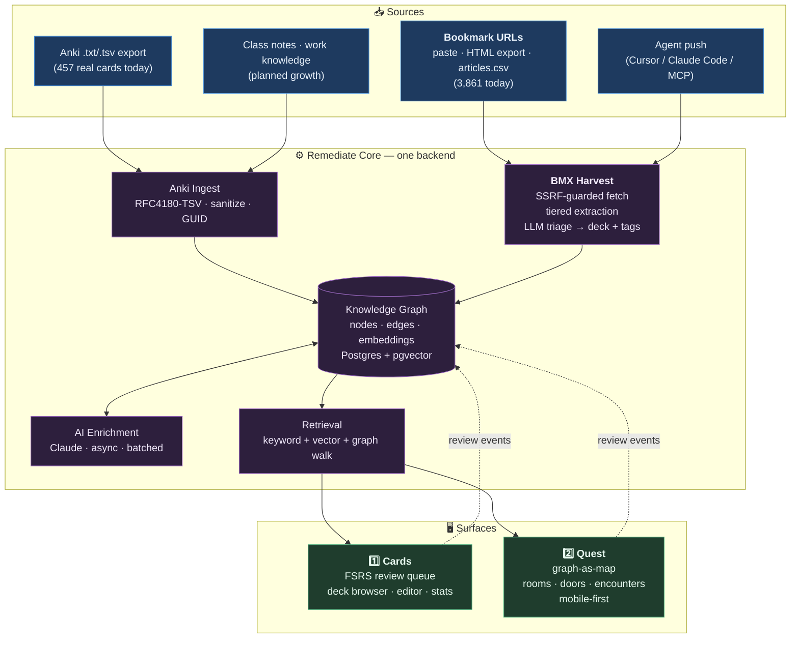
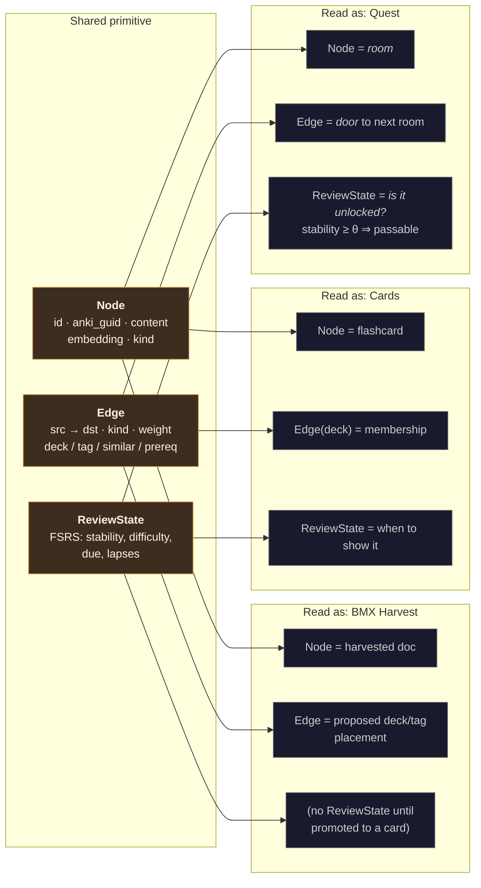
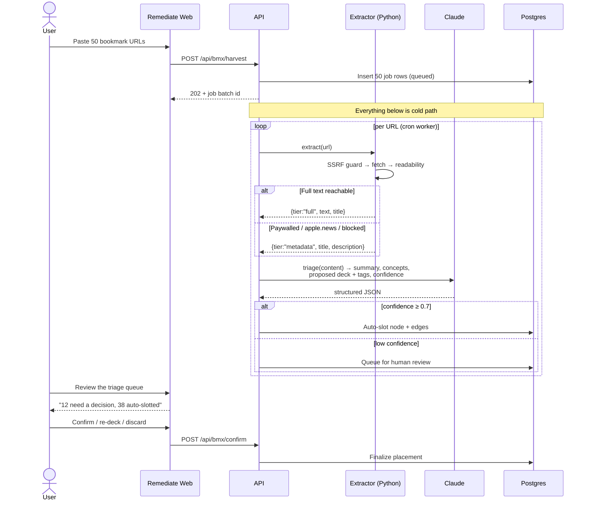
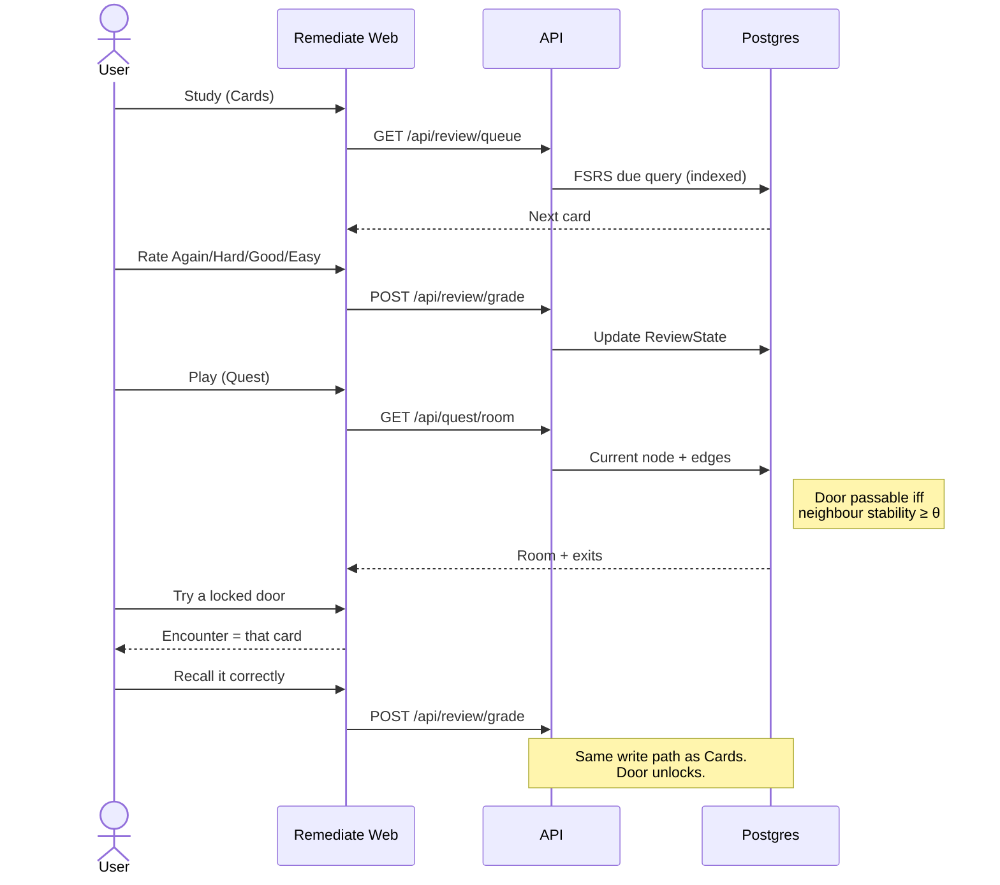

# Remediate — Product Requirements Document

**Status:** Draft v2 · **Date:** 2026-07-15 · **Target prototype:** 2026-07-19
**Companion docs:** [TDD.md](./TDD.md) (how it's built) · [PIPELINE.md](./PIPELINE.md) (who builds what, in what order)

> **v2 changes:** renamed to Remediate (BMX survives as the harvest subsystem) · corpus ground-truthed (457 cards, not 212) · bookmark harvesting restored to P0 as the original vision · Cards explicitly precedes Quest · Anki GUID replaces content-hash as primary identity.

---

## Table of Contents

1. [The One-Paragraph Version](#1-the-one-paragraph-version)
2. [Naming](#2-naming)
3. [Lay of the Land (diagrams first)](#3-lay-of-the-land)
   - 3.1 [Product surface map](#31-product-surface-map)
   - 3.2 [The core insight: one graph, three faces](#32-the-core-insight-one-graph-three-faces)
   - 3.3 [The two user journeys](#33-the-two-user-journeys)
4. [Problem & Motivation](#4-problem--motivation)
5. [Users & Jobs To Be Done](#5-users--jobs-to-be-done)
6. [The Corpus (ground truth)](#6-the-corpus-ground-truth)
7. [Scope](#7-scope)
8. [Feature Requirements](#8-feature-requirements)
   - 8.1 [Ingest — Anki](#81-ingest--anki)
   - 8.2 [Harvest — BMX bookmark pipeline](#82-harvest--bmx-bookmark-pipeline)
   - 8.3 [Cards — the Anki surface](#83-cards--the-anki-surface)
   - 8.4 [Quest — the game surface](#84-quest--the-game-surface)
   - 8.5 [AI enrichment](#85-ai-enrichment)
9. [Non-Functional Requirements](#9-non-functional-requirements)
10. [Security Requirements](#10-security-requirements)
11. [Cost Model](#11-cost-model)
12. [Success Criteria](#12-success-criteria)
13. [Open Questions](#13-open-questions)

---

## 1. The One-Paragraph Version

**Remediate** turns a personal knowledge corpus — Anki decks, bookmarks, class notes, work knowledge — into a single connected graph, and exposes it through surfaces that share one backend. **BMX** (the BookMark eXtractor, the project's original vision) harvests URLs: you paste a pile of links, and their content is fetched, extracted, triaged by an LLM, and slotted into the graph with the right deck and tags. **Cards** is an Anki-compatible spaced-repetition surface you can feed your existing decks into. **Quest** is an exploratory adventure game played over the same graph, where rooms are concepts, doors are relationships, and progress is gated by actual recall. The idea that makes this one product rather than three: *the scheduler's memory model and the game's progression system are the same column in the same table.* Mastery is movement.

The name is the thesis. To **remediate** is to fix a gap — which is what spaced repetition does to memory. To **re-mediate** is to present material through a new medium — which is what the game does to a flashcard. It's playful and it's literal.

---

## 2. Naming

| Thing | Name | Notes |
|---|---|---|
| Product / domain | **Remediate** — `remediate.app` | Owned. The FastAPI title `"Remediate.app Backend"` in the current repo was *intent*, not leftover — v1 of this doc read it as cruft and was wrong. |
| Repo | `remediate.app` | Matches the domain exactly. See [PIPELINE §4 Phase 0](./PIPELINE.md#phase-0--rename--clear-the-ground) for the safe rename order. |
| Harvest subsystem | **BMX** (BookMark eXtractor) | Kept deliberately. It's an accurate name for exactly one subsystem, and it preserves the project's origin story instead of erasing it. `src/lib/server/bmx/`. |
| SRS surface | **Cards** | |
| Game surface | **Quest** | |

---

## 3. Lay of the Land

### 3.1 Product surface map

### 3.2 The core insight: one graph, three faces

The same row in the same table is a flashcard, a room, and a harvested article.

> **Why this matters:** a reader should see one idea, not three half-apps. Recall performance drives both the scheduler and the game's world state from a single write path. A harvested bookmark and a hand-written flashcard are the same kind of thing, so BMX's output is immediately reviewable *and* immediately playable. Nothing is duplicated.

### 3.3 The two user journeys

**Journey A — BMX harvest (the original vision):**

**Journey B — study, then play:**

---

## 4. Problem & Motivation

Knowledge accumulates in places that don't talk to each other: Anki decks, browser bookmarks, read-later queues, class notes, the things you learn at work and never write down. Each is a write-only pile.

Three failures compound:

1. **Capture has no triage.** 3,861 bookmarks sit in `articles.csv`. Saving a link costs two seconds and buys nothing; the decision about *what it was for* never happens. BMX's job is to make that decision automatically and be right often enough to be trusted.
2. **No connective tissue.** A card about `kin selection` and a bookmarked piece on green-hydrogen policy both touch incentive design; nothing in the stack knows that. The value of a corpus is in its edges, and no consumer tool builds them.
3. **Review is a chore.** Anki's retention curve is genuinely good, but the loop is joyless. Adherence is the binding constraint on spaced repetition — a scheduler you abandon has an effective retention of zero.

Remediate addresses (1) with BMX, (2) with an AI-built graph, and (3) by making traversal of that graph the reward loop.

---

## 5. Users & Jobs To Be Done

| User | Job | Success looks like |
|---|---|---|
| **Primary — the owner** | "I have 457 Anki cards and 3,861 bookmarks. Get them into one system I actually open." | Decks import losslessly; bookmarks self-triage; review is at least as good as Anki. |
| **Primary — the owner** | "Keep feeding it: CompSci class notes, things I learn as a full-stack engineer." | Paste URLs or notes; they land in the right deck without manual filing. |
| **Primary — the owner** | "Show this to someone evaluating me technically." | The repo reads as deliberate: typed end to end, tested, secure by construction, deployed, cheap. |
| **Secondary — a curious visitor** | "Play someone else's knowledge as a game." | Uploads a bookmark export, gets a playable map in <2 min, on a phone, no account. |
| **Tertiary — an agent** | "Push knowledge into Remediate programmatically." | Documented, authenticated, rate-limited ingest endpoint. |

---

## 6. The Corpus (ground truth)

Measured, not estimated. Every number below came from parsing the actual files in `source_data/`, and each one changed a design decision.

| Source | Raw lines | **True records** | Notes |
|---|---:|---:|---|
| `Anthro (Psych_Soc_Econ_Health).txt` | 4,053 | **320** | Real Anki export |
| `CompSci (AIML_Web3_Math_Logic_Tech).txt` | 576 | **137** | Real Anki export |
| `anki_cards.csv` | 213 | 212 | **Lossy derivative** of Anthro. Not the source of truth. |
| `articles.csv` | 3,862 | **3,861** | Bookmark metadata |

**Findings that drive requirements:**

1. **Line-based parsing destroys the data.** 4,629 raw lines contain 457 records. 23 CompSci records carry embedded newlines inside quoted fields. A naive `split('\n')` then `split('\t')` yields ~90% garbage rows — and it fails *silently*, producing plausible-looking junk (`
` as a notetype). → [ING-2](#81-ingest--anki)
2. **Anki GUIDs exist and are stable.** All 457 are unique, zero collisions. This is a better identity than a content hash: it survives edits, so re-importing an edited deck updates instead of duplicating. v1 of this doc recommended content-hashing because it only looked at the CSV, which has no GUID column. → [ING-3](#81-ingest--anki)
3. **GUIDs are hostile strings.** The alphabet is base91: ``!#$%&()*+,-./:;<=>?@[]^_`{|}~`` plus alphanumerics. Real examples: `tNcJ[p<DNp`, `LKmX%^wX6E`, ``eATLwgRPX` ``. A GUID contains `<` and `&` (breaks HTML if unescaped) and `/`, `?`, `#`, `%` (breaks URL paths). → [ING-4](#81-ingest--anki), [SEC-1](#10-security-requirements)
4. **Fields are enormous.** Longest `Back` is **47,952 characters**. p95 is 6k (Anthro) / 11k (CompSci). One card is ~12k tokens — enrichment and embedding must chunk or truncate, and a naive "embed the whole field" blows the context budget. → [AI-2](#85-ai-enrichment)
5. **Content is real HTML with links.** `#html:true`, 27 `<a href="https://en.wikipedia.org/...">` in CompSci alone. Escaping renders every card broken; sanitizing is the only option, and the allowlist must include `<a>` with a protocol check. → [SEC-1](#10-security-requirements)
6. **Deck names contain `/`.** `CompSci (AIML/Web3/Math/Logic/Tech)`. Anki's hierarchy separator is `::`. Splitting on `/` shatters 2 decks into ~10 bogus ones. → [CRD-6](#83-cards--the-anki-surface)
7. **~45% of bookmarks won't yield full text.** Top domains: WSJ 759, **apple.news 643**, LA Times 458, Bloomberg 367, Wired 362, Business Insider 336, The Atlantic 326, Politico 188. WSJ/Bloomberg/Atlantic are hard-paywalled; `apple.news` links are opaque JS redirects that server-side fetch cannot resolve. A naive fetch-and-extract pipeline fails on roughly half the corpus. → [HRV-3](#82-harvest--bmx-bookmark-pipeline), the tiered-extraction requirement

> **The good news on (7):** `articles.csv` already carries `title`, `description`, `author`, and `date` for all 3,861. So the metadata is *already harvested* — the pipeline degrades to metadata-only enrichment rather than failing. A paywalled Bloomberg piece still gets a title, a description, an embedding, and a graph position. Just at lower fidelity, and marked as such.

---

## 7. Scope

### 7.1 In scope for the prototype (P0)

Ordered by build sequence. **Cards ships before Quest** — see [PIPELINE.md](./PIPELINE.md).

| # | Requirement | Phase |
|---|---|---|
| P0-1 | Rename to Remediate; delete Neo4j/GraphQL/prod-Docker cruft | 0 |
| P0-2 | Import real Anki `.txt` exports (RFC4180 TSV, GUID identity, multi-line fields) | 2 |
| P0-3 | HTML sanitization at ingest, allowlist-based, `<a>` protocol-checked | 2 |
| P0-4 | **Cards: FSRS-6 scheduling + review UI** | 3 |
| P0-5 | Deck + tag browsing, card CRUD, stats | 3 |
| P0-6 | **BMX: paste URLs → SSRF-guarded fetch → tiered extract → LLM triage → slot** | 4 |
| P0-7 | BMX triage review queue (confirm / re-deck / discard) | 4 |
| P0-8 | AI enrichment: embeddings, concepts, `similar_to` + `prereq_of` edges | 5 |
| P0-9 | Quest: graph-as-map, recall-gated doors, mobile-first | 6 |
| P0-10 | Auth + per-user isolation enforced at the DB (RLS) | 1 |
| P0-11 | Deployed to `remediate.app` with a strict CSP | 7 |

### 7.2 Fast-follow (P1)

- `.apkg` (SQLite-in-zip) import.
- Export back to Anki-importable TSV with GUIDs preserved (round-trip fidelity).
- Cloze deletion note type. *(Today's corpus is 100% `Basic` — this is genuinely not needed yet.)*
- `apple.news` resolution via a headless fetch or the Apple News API.
- Reader-mode / archive.org fallback for paywalled domains.
- Media (images/audio) via Vercel Blob.
- LLM-generated Quest narration.
- MCP server so Claude Code can push/query Remediate directly.
- Public share links for a Quest map.

### 7.3 Explicitly out of scope

- **AnkiWeb sync protocol.** Reverse-engineering it is a project unto itself.
- **Paywall circumvention.** Tiered extraction degrades gracefully; it does not bypass. This is both a legal and an ethical line, and it's not negotiable.
- **Collaborative/multiplayer editing.**
- **A native mobile app.** PWA suffices; "enjoyable on a phone" is a responsive requirement.
- **Training a local model.** `source_data/README.md` mentions a 30M-parameter goal. Frontier APIs beat it on every axis. Removed.
- **Neo4j.** See [TDD §3.2](./TDD.md#32-why-not-neo4j).

---

## 8. Feature Requirements

### 8.1 Ingest — Anki

| ID | Requirement |
|---|---|
| **ING-1** | Accept real Anki exports (`.txt`/`.tsv`) and the legacy `.csv`. Honour the `#separator:`, `#html:`, `#guid column:`, `#notetype column:`, `#deck column:`, `#tags column:` preamble; use it to map columns rather than assuming positions. |
| **ING-2** | **Parse with a real RFC4180 parser** configured `delimiter=\t, quote=", escape=""`, multi-line fields enabled. Never `split('\n')`. Ground truth: 4,629 lines → 457 records. |
| **ING-3** | **Identity = Anki GUID** when the export declares `#guid column:`. Fall back to `sha256(deck‖front‖back)[:16]` only for the legacy CSV. Re-import is idempotent: same GUID ⇒ update, never duplicate. |
| **ING-4** | GUIDs are base91 and contain HTML- and URL-hostile characters. Store the GUID as a unique column; derive a URL-safe internal ID (`base64url(sha256(guid))[:16]`) for routes and DOM ids. Never interpolate a raw GUID into markup or a path. |
| **ING-5** | Tags are **space-separated within one column** (`dataflow fullstack webdev`). Split on whitespace, not commas. |
| **ING-6** | Sanitize every HTML field with an allowlist. Store sanitized only. |
| **ING-7** | Reject > 25 MB / > 100k records at the edge. Stream-parse. |
| **ING-8** | Return `202` + job ID. Enrichment is out of the request path. |
| **ING-9** | Preserve `notetype` per note. Today all 457 are `Basic`; the column exists so P1 cloze support doesn't need a migration. |

### 8.2 Harvest — BMX bookmark pipeline

> This is the project's original vision and a P0 pipeline, not a nice-to-have.

| ID | Requirement |
|---|---|
| **HRV-1** | Accept: pasted URL list (newline/comma separated), Netscape bookmark HTML export, and the `articles.csv` shape (`id,date,url,title,description,image,author`). |
| **HRV-2** | Fetch is **SSRF-guarded**: resolve DNS first, reject private/link-local/loopback/metadata ranges, cap redirects at 3 and re-check every hop, cap body at 5 MB, 10s timeout. |
| **HRV-3** | **Tiered extraction — this is the core of the design**, given that ~45% of the real corpus is unreachable:  • **Tier 1 `full`** — readability/trafilatura extracts main content.  • **Tier 2 `metadata`** — paywalled/blocked/JS-redirect: use `<meta>` OG tags, or the pre-harvested `title`/`description` from `articles.csv`.  • **Tier 3 `failed`** — record the URL and the reason; never silently drop.  Every node stores its `extraction_tier`. |
| **HRV-4** | **LLM triage:** given extracted content, return `{summary, concepts[], proposed_deck, proposed_tags[], confidence}` via structured outputs. Deck/tag proposals must be constrained to the user's *existing* decks and tags plus an explicit `"__new__"` escape — an unconstrained model invents a new taxonomy on every run. |
| **HRV-5** | **Auto-slot at `confidence ≥ 0.7`; queue for human review below.** Tier-2 (metadata-only) extractions cap at `confidence ≤ 0.6`, so they always get a human look. |
| **HRV-6** | Triage review queue UI: batch confirm, re-deck, re-tag, discard. Keyboard-driven. This is the human-in-the-loop that makes auto-slotting trustworthy. |
| **HRV-7** | Deduplicate on normalized URL (strip `utm_*`, fragments, trailing slash) **and** on content hash — the corpus contains the same story via both `apple.news` and the publisher's own domain. |
| **HRV-8** | A harvested doc becomes a reviewable card only when the user promotes it (or accepts an LLM-proposed Q/A pair). Harvesting ≠ enrolling 3,861 items into your review queue. |
| **HRV-9** | Respect `robots.txt`; identify with a real User-Agent; rate-limit per domain (≥1s). 759 requests to WSJ in a burst is abuse. |

### 8.3 Cards — the Anki surface

> **Built first** (Phase 3), before Quest. It is a shippable product alone.

| ID | Requirement |
|---|---|
| **CRD-1** | FSRS-6 via `ts-fsrs`. Store full state: stability, difficulty, due, reps, lapses, state, last_review. |
| **CRD-2** | Four-button grade with **projected next interval shown on each button** before committing. This is the Anki behaviour clones most often miss. |
| **CRD-3** | Queue respects due date + per-deck daily new/review limits. |
| **CRD-4** | Keyboard-first: `Space` reveal, `1–4` grade, `E` edit, `U` undo. |
| **CRD-5** | Undo last review (one level). |
| **CRD-6** | Deck browsing. Anki's hierarchy separator is `::`, **not** `/`. Both real deck names contain `/`; treat them as flat. |
| **CRD-7** | Render sanitized HTML faithfully — `<a>` links open in a new tab with `rel="noopener noreferrer"`. |
| **CRD-8** | Long fields (up to 48k chars) must not break layout: scroll within the card, don't overflow the page. |
| **CRD-9** | Stats: retention rate, reviews/day heatmap, due forecast. |

### 8.4 Quest — the game surface

| ID | Requirement |
|---|---|
| **QST-1** | The map *is* the graph. No hand-authored levels. Room = node; exits = edges. |
| **QST-2** | **Doors are recall-gated.** Edge passable iff neighbour's FSRS `stability ≥ θ`. A locked door triggers an encounter — which is the card. |
| **QST-3** | Grading in Quest calls the *same* `POST /api/review/grade` as Cards. Exactly one review write path exists in the system. |
| **QST-4** | Position, visited set, run state persist server-side. |
| **QST-5** | Mobile-first: thumb-reachable, ≥44px targets, 360px width, no horizontal scroll. |
| **QST-6** | Anonymous play: upload a bookmark file → session-scoped ephemeral graph, no account, 24h TTL, node-capped, **no LLM access**. |
| **QST-7** | Room text templated from node content in P0. LLM narration is P1 — see [TDD §7.3](./TDD.md#73-prompt-injection-is-the-real-ai-risk). |

### 8.5 AI enrichment

| ID | Requirement |
|---|---|
| **AI-1** | `claude-opus-4-8`, adaptive thinking. Bulk work via Batch API (−50%) with prompt caching on the frozen system prefix (~0.1× on cached tokens). |
| **AI-2** | **Chunk before embedding.** Fields reach 48k chars (~12k tokens). Embed the first ~2k tokens plus the AI summary; do not embed raw 48k blobs. |
| **AI-3** | Per node: 1-sentence summary, 3–7 concepts, difficulty 1–5. Structured outputs only — never free-text parsing. |
| **AI-4** | `similar_to` edges at cosine ≥ 0.82, capped at 8/node. A cap is what keeps the map traversable rather than a hairball. |
| **AI-5** | `prereq_of` edges between concepts. These give Quest's map a *gradient* — without direction it's a flat mesh and every room looks alike. |
| **AI-6** | **All corpus content is untrusted.** Passed as delimited data in the user turn, never in the system prompt, never with side-effecting tools available. |
| **AI-7** | Hard per-user token budget checked before dispatch. An AI endpoint without a budget is a billing DoS. |

---

## 9. Non-Functional Requirements

| Axis | Target | Why |
|---|---|---|
| **Review latency** | grade → next < 100ms p95 | Anki desktop is instant. This forces the hot path to one indexed write + one indexed read — no AI, no fan-out. |
| **Quest room transition** | < 200ms p95 | Games feel broken above this. |
| **Anki import** | 457 cards < 5s; 10k < 30s | 20× headroom on the real corpus. |
| **BMX harvest** | ≥ 1 URL/s sustained, per-domain ≥1s spacing | Cold path; throughput over latency. HRV-9. |
| **Mobile** | Lighthouse ≥ 90 perf/a11y, LCP < 2.0s on 4G | QST-5 is a hard requirement, so measure it. |
| **Hosting cost** | < $5/mo at personal scale | See §11. |
| **Type safety** | Zero `any` in `src/lib/server`; `strict: true` | The compiler should be doing the work. |
| **Test coverage** | 100% on the TSV parser, the sanitizer, the FSRS wrapper, and the SSRF guard | The four places where bugs are silent and expensive. Coverage elsewhere is negotiable. |

---

## 10. Security Requirements

> Mechanisms in [TDD §7](./TDD.md#7-security-architecture). Four of these threats are present in the data in this repo *today*.

| ID | Requirement | Grounded in |
|---|---|---|
| **SEC-1** | Imported HTML must never execute. Allowlist sanitize at ingest + strict CSP with nonces. `<a href>` restricted to `http/https/mailto`. GUIDs escaped before any markup or URL use. | 27 live `<a href>` in CompSci; GUIDs contain `<` and `&`. |
| **SEC-2** | **SSRF guard on all BMX fetches**: post-DNS-resolution IP check, redirect re-validation, no metadata/private ranges. | BMX fetches arbitrary user-supplied URLs. This is the single highest-severity new surface the harvester introduces. |
| **SEC-3** | CSV/TSV export must neutralize formula injection (`= + - @`, tab, CR prefixes). | Round-trip export is P1 and a classic vector. |
| **SEC-4** | Untrusted content structurally isolated from LLM instructions. No side-effecting tools in enrichment or triage. | Bookmarked pages are attacker-authored by definition. |
| **SEC-5** | Tenant isolation at the database (RLS), not only app code. | One forgotten `where` from a full breach. |
| **SEC-6** | Rate limits + per-user token budgets on every AI endpoint; per-domain politeness on fetch. | Cost DoS; and 759 rapid requests to WSJ is abuse. |
| **SEC-7** | Argon2id passwords; passkeys preferred. Cookies `HttpOnly; Secure; SameSite=Lax`. Origin-checked mutations. | Baseline. |
| **SEC-8** | Remove `X-XSS-Protection` from `vercel.json`. | Deprecated; its filter has itself been an XSS vector. Shipping it beside a real CSP signals cargo-culting. |
| **SEC-9** | Zip-bomb / decompression limits when `.apkg` lands (P1). | Deferred with the feature. |

---

## 11. Cost Model

Target: **under $5/month** at personal scale.

| Line item | Choice | Cost | Notes |
|---|---|---|---|
| Hosting | Vercel Hobby → Pro | $0 → $20 | Fluid compute bills active CPU, not I/O wait — AI calls and fetches are nearly free. |
| Database | Neon Postgres | $0 | Free tier 0.5 GB, scales to zero. Corpus is ~15 MB of text. |
| Vector | pgvector (in Neon) | $0 | No separate store. [TDD §3.3](./TDD.md#33-why-not-a-dedicated-vector-db). |
| **Anki enrichment** | `claude-opus-4-8`, Batch | **~$0.05 one-time** | 457 cards, chunked to ~2k tok in / 200 tok out ≈ 914k in / 91k out. At $5/$25 per MTok, halved by Batch: ≈ $2.29 + $1.14… |
| | | | …**≈ $3.43, actually.** Worth stating honestly rather than rounding to zero. Chunking (AI-2) is what keeps it here instead of ~$15 on raw 48k-char fields. |
| **BMX triage** | `claude-opus-4-8`, Batch, tiered | **~$8 one-time** for all 3,861 | Tier-2 (metadata-only, ~45%) costs ~⅕ of Tier-1 — the paywall constraint is accidentally a cost saving. Harvest incrementally, not all at once. |
| Quest narration (P1) | cached prefix | ~$0.50/mo | |
| **Steady state** | | **≈ $0–1/mo** | One-time backfill ≈ $12. |

The cost story is a *design* outcome: scale-to-zero Postgres, no always-on container, no second service, batch + cache + chunk on the AI path.

---

## 12. Success Criteria

1. ✅ Both `.txt` exports import cleanly — **457 cards** (320 + 137), 2 decks, tags intact, 23 multi-line records intact, zero HTML artifacts rendered as text, zero script execution.
2. ✅ Re-importing the same file changes nothing (GUID idempotency).
3. ✅ A full review session runs on a phone; grade → next < 100ms p95.
4. ✅ **BMX: paste 20 mixed URLs (incl. a WSJ paywall and an `apple.news` link) → all 20 land in the graph**, tiered correctly, none silently dropped, low-confidence ones queued.
5. ✅ Quest renders a navigable map with ≥1 AI-derived `prereq_of` edge a human agrees with.
6. ✅ **A locked door opens because a card was recalled.**
7. ✅ Deployed at `remediate.app`. Strict CSP. `securityheaders.com` grade A.
8. ✅ CI green: typecheck, lint, unit, e2e.
9. ✅ `git clone` → running locally in < 5 min from the README alone.

---

## 13. Open Questions

| # | Question | Owner | Blocks | Default if unanswered |
|---|---|---|---|---|
| Q1 | Anonymous Quest play (QST-6) in P0, or auth-only? | Human | Quest scope | **Ship it.** It's the demo path. |
| Q2 | Is the `stability ≥ θ` door gate satisfying or punishing? | Human (playtest) | QST-2 tuning | Start `θ = 1.0` (one successful recall); tune after playtest. |
| Q3 | Keep Python? | Human | Repo layout | **Yes — narrowly.** One cold-path extractor function, not a FastAPI app. See [TDD §3.1](./TDD.md#31-python-the-honest-answer). |
| Q4 | ~~Is the graph dense enough to be interesting?~~ | — | — | **Largely resolved.** 457 cards + 3,861 bookmarks ≈ 4,300 nodes today, growing with class notes and work knowledge. Risk downgraded High → Medium ([TDD R1](./TDD.md#11-risks)); the B3 gate stays because *density* ≠ *meaningfulness*. |
| Q5 | Auto-slot threshold at 0.7 — too eager, or not eager enough? | Human | HRV-5 tuning | Start 0.7. If the review queue is mostly rubber-stamping, raise it; if you're undoing auto-slots, lower it. |
| Q6 | Promote harvested docs to cards automatically? | Human | HRV-8 | **No.** 3,861 auto-enrolled cards would destroy the review queue. Promotion stays manual until there's a reason. |
