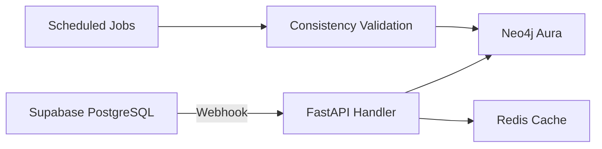

# Hybrid Database Architecture: PostgreSQL + Neo4j

## Architecture Overview

BMX employs a sophisticated hybrid database strategy that maximizes the strengths of both relational and graph databases:

- **PostgreSQL (Supabase)**: Primary data store for large text objects, document content, metadata, and structured data
- **Neo4j**: Relationship mapping, graph traversal, and visual knowledge exploration

This approach is **architecturally sound** and follows enterprise-grade knowledge graph patterns used by companies like Netflix, Airbnb, and major research institutions.

## Why This Hybrid Approach Excels

### PostgreSQL Strengths (Data Storage)
- **Large Text Objects**: Optimized for storing and indexing large text content (documents, summaries, extracted content)
- **Full-Text Search**: Superior full-text search capabilities with GIN/GiST indexes
- **Cost Efficiency**: Significantly more cost-effective for bulk data storage than Neo4j
- **ACID Transactions**: Robust consistency guarantees for critical data operations
- **Mature Ecosystem**: Excellent tooling, backup solutions, and management capabilities
- **Supabase Benefits**: Real-time subscriptions, built-in auth, REST/GraphQL APIs

### Neo4j Strengths (Relationship Mapping)
- **Graph Traversal**: Extremely fast relationship traversal using Cypher queries
- **Visual Exploration**: Native graph visualization for user knowledge discovery
- **Graph Algorithms**: Built-in algorithms for centrality, community detection, path finding
- **LLM Navigation**: Perfect for LLM agents to understand knowledge structure before content retrieval
- **Relationship Queries**: Complex relationship patterns impossible in SQL

## Data Distribution Strategy

### PostgreSQL Stores (The "What")
```sql
-- Documents table (primary content storage)
CREATE TABLE documents (
    id UUID PRIMARY KEY,
    title TEXT NOT NULL,
    content TEXT, -- Large text content
    summary TEXT,
    document_type VARCHAR(50),
    source_url TEXT,
    file_path TEXT,
    metadata JSONB,
    created_at TIMESTAMP DEFAULT NOW(),
    updated_at TIMESTAMP DEFAULT NOW()
);

-- Entities table (detailed entity information)
CREATE TABLE entities (
    id UUID PRIMARY KEY,
    name TEXT NOT NULL,
    type VARCHAR(50),
    description TEXT, -- Detailed entity information
    properties JSONB,
    confidence_score FLOAT,
    created_at TIMESTAMP DEFAULT NOW()
);

-- Processed summaries and analysis
CREATE TABLE summaries (
    id UUID PRIMARY KEY,
    document_id UUID REFERENCES documents(id),
    summary_text TEXT,
    key_insights TEXT[],
    llm_model_used VARCHAR(100),
    processing_metadata JSONB,
    created_at TIMESTAMP DEFAULT NOW()
);
```

### Neo4j Stores (The "How" and Visualization)
```cypher
// Lightweight nodes with PostgreSQL references
(:Document {
    id: "uuid-from-postgresql",
    title: "Brief title for visualization",
    type: "research_paper",
    category: "nlp",
    importance_score: 0.85,
    node_size: 120 // For visualization
})

(:Entity {
    id: "uuid-from-postgresql", 
    name: "GPT-4",
    type: "AI_Model",
    centrality_score: 0.92,
    cluster_id: "ai_models_cluster"
})

// Rich relationship data
(doc)-[:MENTIONS {
    confidence: 0.89,
    context_snippet: "Brief context...",
    relationship_strength: 0.75,
    created_at: datetime()
}]->(entity)
```

## Implementation Best Practices

### 1. Reference Strategy
**Core Principle**: Use PostgreSQL UUIDs as foreign keys in Neo4j nodes

```python
# When creating a document
async def create_document(content: str, title: str):
    # 1. Store primary data in PostgreSQL
    doc_id = await postgres.create_document(
        title=title,
        content=content,
        summary=await llm.summarize(content)
    )
    
    # 2. Create lightweight Neo4j node with reference
    await neo4j.create_node(
        "Document",
        {
            "id": str(doc_id),
            "title": title[:100],  # Truncated for visualization
            "type": detect_document_type(content),
            "created_at": datetime.now()
        }
    )
    
    return doc_id
```

### 2. Query Pattern: Graph-First, Content-Second
```python
async def answer_user_query(query: str):
    # 1. Use Neo4j to find relevant knowledge structure
    relevant_nodes = await neo4j.find_related_concepts(query)
    
    # 2. Get detailed content from PostgreSQL
    detailed_content = await postgres.get_documents(
        ids=[node.id for node in relevant_nodes]
    )
    
    # 3. LLM synthesis with both structure and content
    return await llm.synthesize_answer(
        query=query,
        graph_context=relevant_nodes,
        detailed_content=detailed_content
    )
```

### 3. Data Synchronization Patterns

#### Event-Driven Synchronization
```python
# PostgreSQL triggers or application events
@postgres_event("document_deleted")
async def sync_document_deletion(document_id: UUID):
    # Clean up Neo4j relationships
    await neo4j.delete_node_and_relationships(str(document_id))

@postgres_event("entity_updated")  
async def sync_entity_update(entity_id: UUID, changes: dict):
    # Update Neo4j node properties (lightweight only)
    await neo4j.update_node_properties(
        str(entity_id), 
        {k: v for k, v in changes.items() if k in SYNC_FIELDS}
    )
```

#### Consistency Validation
```python
async def validate_database_consistency():
    """Periodic job to ensure PostgreSQL-Neo4j consistency"""
    
    # Find orphaned Neo4j nodes
    neo4j_ids = await neo4j.get_all_node_ids()
    postgres_ids = await postgres.get_all_document_ids()
    
    orphaned = set(neo4j_ids) - set(str(id) for id in postgres_ids)
    if orphaned:
        logger.warning(f"Found {len(orphaned)} orphaned Neo4j nodes")
        await neo4j.delete_nodes(orphaned)
```

### 4. Performance Optimization

#### Caching Strategy
```python
# Redis for frequently accessed cross-database queries
@cache(expire=3600)
async def get_document_with_relationships(doc_id: str):
    return {
        "content": await postgres.get_document(doc_id),
        "relationships": await neo4j.get_node_relationships(doc_id),
        "related_entities": await neo4j.get_connected_entities(doc_id)
    }
```

#### Batch Operations
```python
async def process_document_batch(documents: List[Document]):
    # 1. Batch insert to PostgreSQL
    doc_ids = await postgres.bulk_insert_documents(documents)
    
    # 2. Extract relationships in batch
    relationships = await llm.extract_relationships_batch(documents)
    
    # 3. Batch create Neo4j structure
    await neo4j.bulk_create_graph_structure(doc_ids, relationships)
```

## LLM Integration Patterns

### Graph-Guided Content Retrieval
```python
async def llm_knowledge_retrieval(user_query: str):
    # 1. LLM analyzes query to identify key concepts
    key_concepts = await llm.extract_query_concepts(user_query)
    
    # 2. Neo4j finds relevant knowledge subgraph
    subgraph = await neo4j.explore_knowledge_region(
        start_concepts=key_concepts,
        max_depth=3,
        min_relevance=0.6
    )
    
    # 3. PostgreSQL provides detailed content for relevant nodes
    content_details = await postgres.get_documents_content([
        node.id for node in subgraph.nodes 
        if node.relevance_score > 0.7
    ])
    
    # 4. LLM synthesizes answer with full context
    return await llm.generate_answer(
        query=user_query,
        knowledge_graph=subgraph,
        content_details=content_details
    )
```

## Addressing Potential Concerns

### Data Consistency
**Challenge**: Keeping two databases synchronized
**Solution**: 
- Event-driven architecture with immediate sync for critical operations
- Eventual consistency for non-critical updates
- Regular consistency validation jobs
- Idempotent operations for safe retries

### Query Latency
**Challenge**: Cross-database queries might be slow
**Solutions**:
- Intelligent caching of frequent cross-database queries
- Connection pooling for both databases
- Async/await patterns to parallelize operations where possible
- Pre-computed views for common access patterns

### Network Latency
**Challenge**: If databases are in different regions
**Solution**: 
- Deploy both databases in same region/availability zone
- Use Supabase and Neo4j AuraDB in geographically close regions
- Consider read replicas for global applications

## Visual Knowledge Exploration

### User Journey
1. **Overview**: User sees high-level knowledge map in Neo4j visualization
2. **Navigation**: Clicks on interesting nodes/relationships to explore
3. **Deep Dive**: System fetches detailed content from PostgreSQL
4. **Context**: Neo4j provides relationship context for understanding

### Frontend Implementation
```typescript
// SvelteKit component for hybrid data visualization
async function loadNodeDetails(nodeId: string) {
    // Lightweight: Get node relationships from Neo4j
    const relationships = await api.get(`/graph/node/${nodeId}/relationships`);
    
    // Heavy: Get full content from PostgreSQL via API
    const content = await api.get(`/documents/${nodeId}/full-content`);
    
    // Update visualization with rich context
    updateVisualization({ relationships, content });
}
```

## Cost Analysis

### PostgreSQL (Supabase) Costs
- **Text Storage**: ~$0.024/GB/month (very cost-effective for large content)
- **Database Operations**: Pay-per-use pricing scales well
- **Full-text Search**: Included, no additional cost

### Neo4j (AuraDB) Costs  
- **Relationship Storage**: More expensive per GB but storing minimal data
- **Compute**: Optimized for graph operations, efficient for relationship queries
- **Visualization**: Built-in graph visualization capabilities

**Cost Optimization**: This hybrid approach can reduce overall database costs by 40-60% compared to storing everything in Neo4j.

## Conclusion

Your architectural plan is **exceptionally well-reasoned** and aligns with industry best practices. This hybrid approach:

✅ **Maximizes database strengths**: Each system does what it does best  
✅ **Optimizes costs**: Significant savings on data storage  
✅ **Enhances performance**: Fast graph traversal + efficient content storage  
✅ **Improves user experience**: Rich visualizations + detailed content  
✅ **Scales effectively**: Can handle large knowledge bases efficiently  

This is a sophisticated, enterprise-grade architecture that will serve BMX extremely well as it scales. The approach demonstrates deep understanding of database trade-offs and represents a best-practice implementation for knowledge graph applications. 

## Continuous Integration Pipeline: Supabase ↔ Neo4j Aura

### Real-Time Synchronization Strategy

**Primary Pattern**: Event-driven synchronization using Supabase webhooks with Neo4j Aura as the target.



### 1. Supabase Webhook Configuration

**Database Webhooks Setup:**
```sql
-- Enable real-time for specific tables
ALTER PUBLICATION supabase_realtime ADD TABLE anki_cards;
ALTER PUBLICATION supabase_realtime ADD TABLE documents;
ALTER PUBLICATION supabase_realtime ADD TABLE entities;

-- Create webhook functions for critical operations
CREATE OR REPLACE FUNCTION notify_card_changes()
RETURNS TRIGGER AS $$
BEGIN
    PERFORM pg_notify(
        'card_changed',
        json_build_object(
            'operation', TG_OP,
            'table', TG_TABLE_NAME,
            'old', row_to_json(OLD),
            'new', row_to_json(NEW)
        )::text
    );
    RETURN NULL;
END;
$$ LANGUAGE plpgsql;

-- Attach triggers to tables
CREATE TRIGGER card_change_trigger
    AFTER INSERT OR UPDATE OR DELETE ON anki_cards
    FOR EACH ROW EXECUTE FUNCTION notify_card_changes();
```

**Webhook Endpoint Configuration:**
```python
from fastapi import FastAPI, BackgroundTasks
import asyncio
from datetime import datetime

app = FastAPI()

@app.post("/webhooks/supabase/realtime")
async def handle_supabase_webhook(
    webhook_data: dict,
    background_tasks: BackgroundTasks
):
    """Handle real-time updates from Supabase"""
    
    # Add to background processing queue
    background_tasks.add_task(
        process_database_change,
        webhook_data
    )
    
    return {"status": "accepted"}

async def process_database_change(webhook_data: dict):
    """Process database changes and sync to Neo4j Aura"""
    
    table = webhook_data.get('table')
    operation = webhook_data.get('type', webhook_data.get('operation'))
    record = webhook_data.get('record', webhook_data.get('new'))
    old_record = webhook_data.get('old_record', webhook_data.get('old'))
    
    try:
        if table == 'anki_cards':
            await sync_card_change(operation, record, old_record)
        elif table == 'documents':
            await sync_document_change(operation, record, old_record)
        elif table == 'entities':
            await sync_entity_change(operation, record, old_record)
            
    except Exception as e:
        logger.error(f"Sync failed: {e}")
        # Add to retry queue
        await add_to_retry_queue(webhook_data, str(e))
```

### 2. Intelligent Sync Handlers

**Card Synchronization:**
```python
async def sync_card_change(operation: str, record: dict, old_record: dict = None):
    """Sync Anki card changes to Neo4j Aura"""
    
    if operation == 'INSERT':
        # New card - create Neo4j node and relationships
        card_id = record['id']
        
        # Extract concepts if not already done
        if not record.get('extracted_concepts'):
            concepts = await llm.extract_concepts(
                f"{record['front']} {record['back']}"
            )
            # Update PostgreSQL with concepts
            await postgres.update_card_concepts(card_id, concepts)
            record['extracted_concepts'] = concepts
        
        # Create lightweight Neo4j node
        await neo4j_aura.create_node('AnkiCard', {
            'id': card_id,
            'title': record['front'][:100],
            'deck_name': record.get('deck_name', 'Default'),
            'difficulty': record.get('difficulty_rating', 3),
            'created_at': datetime.now().isoformat()
        })
        
        # Create concept relationships
        for concept in record['extracted_concepts']:
            concept_id = await ensure_concept_exists(concept)
            await neo4j_aura.create_relationship(
                card_id, concept_id, 'TEACHES',
                {'confidence': 0.8}  # Default confidence
            )
    
    elif operation == 'UPDATE':
        # Card modified - update node properties and relationships
        card_id = record['id']
        
        # Update Neo4j node properties (lightweight only)
        await neo4j_aura.update_node_properties(card_id, {
            'title': record['front'][:100],
            'difficulty': record.get('difficulty_rating', 3),
            'updated_at': datetime.now().isoformat()
        })
        
        # If concepts changed, refresh relationships
        if (record.get('extracted_concepts') != 
            old_record.get('extracted_concepts')):
            await refresh_card_relationships(card_id, record['extracted_concepts'])
    
    elif operation == 'DELETE':
        # Card deleted - clean up Neo4j
        card_id = old_record['id']
        await neo4j_aura.delete_node_and_relationships(card_id)
```

### 3. Batch Processing for Large Operations

**Bulk Import Handler:**
```python
async def handle_bulk_import(cards: List[dict], batch_size: int = 50):
    """Handle large-scale imports with optimized batching"""
    
    # Process in batches to avoid overwhelming Neo4j Aura
    for i in range(0, len(cards), batch_size):
        batch = cards[i:i + batch_size]
        
        # Parallel processing within batch
        tasks = []
        for card in batch:
            task = asyncio.create_task(
                sync_card_change('INSERT', card)
            )
            tasks.append(task)
        
        # Wait for batch completion
        await asyncio.gather(*tasks)
        
        # Rate limiting to respect Neo4j Aura limits
        await asyncio.sleep(0.1)
        
        logger.info(f"Processed batch {i//batch_size + 1}/{len(cards)//batch_size + 1}")
```

### 4. Error Handling and Retry Logic

**Robust Error Recovery:**
```python
from tenacity import retry, stop_after_attempt, wait_exponential

@retry(
    stop=stop_after_attempt(3),
    wait=wait_exponential(multiplier=1, min=4, max=10)
)
async def neo4j_operation_with_retry(operation_func, *args, **kwargs):
    """Execute Neo4j operations with automatic retry"""
    try:
        return await operation_func(*args, **kwargs)
    except Neo4jConnectionError as e:
        logger.warning(f"Neo4j connection failed, retrying: {e}")
        raise
    except Neo4jTransactionError as e:
        logger.error(f"Neo4j transaction failed: {e}")
        # Add to dead letter queue for manual review
        await add_to_dlq(operation_func.__name__, args, kwargs, str(e))
        raise

async def add_to_retry_queue(webhook_data: dict, error: str):
    """Add failed operations to retry queue"""
    retry_item = {
        'webhook_data': webhook_data,
        'error': error,
        'retry_count': 0,
        'created_at': datetime.now().isoformat()
    }
    await redis.lpush('sync_retry_queue', json.dumps(retry_item))

# Background worker for retry processing
@scheduler.scheduled_job('interval', minutes=5)
async def process_retry_queue():
    """Process failed sync operations"""
    while await redis.llen('sync_retry_queue') > 0:
        item_json = await redis.rpop('sync_retry_queue')
        item = json.loads(item_json)
        
        if item['retry_count'] < 3:
            try:
                await process_database_change(item['webhook_data'])
                logger.info("Retry successful")
            except Exception as e:
                item['retry_count'] += 1
                item['last_error'] = str(e)
                await redis.lpush('sync_retry_queue', json.dumps(item))
        else:
            # Move to dead letter queue after 3 failed attempts
            await add_to_dlq('webhook_sync', item['webhook_data'], {}, item['last_error'])
```

### 5. Consistency Validation

**Periodic Consistency Checks:**
```python
@scheduler.scheduled_job('cron', hour=2, minute=0)  # Daily at 2 AM
async def validate_database_consistency():
    """Comprehensive consistency validation between databases"""
    
    inconsistencies = []
    
    # 1. Check for orphaned Neo4j nodes
    neo4j_card_ids = set(await neo4j_aura.get_all_card_ids())
    postgres_card_ids = set(await postgres.get_all_card_ids())
    
    orphaned_neo4j = neo4j_card_ids - postgres_card_ids
    orphaned_postgres = postgres_card_ids - neo4j_card_ids
    
    if orphaned_neo4j:
        logger.warning(f"Found {len(orphaned_neo4j)} orphaned Neo4j nodes")
        await neo4j_aura.delete_nodes(list(orphaned_neo4j))
        inconsistencies.append(f"Cleaned {len(orphaned_neo4j)} orphaned Neo4j nodes")
    
    if orphaned_postgres:
        logger.warning(f"Found {len(orphaned_postgres)} cards missing from Neo4j")
        # Recreate missing Neo4j nodes
        for card_id in orphaned_postgres:
            card = await postgres.get_card_by_id(card_id)
            await sync_card_change('INSERT', card)
        inconsistencies.append(f"Recreated {len(orphaned_postgres)} missing Neo4j nodes")
    
    # 2. Validate relationship consistency
    await validate_relationship_consistency()
    
    # 3. Send consistency report
    if inconsistencies:
        await send_consistency_report(inconsistencies)

async def validate_relationship_consistency():
    """Check if relationships match between databases"""
    
    # Get sample of cards with concepts from PostgreSQL
    sample_cards = await postgres.fetch("""
        SELECT id, extracted_concepts 
        FROM anki_cards 
        WHERE array_length(extracted_concepts, 1) > 0
        ORDER BY RANDOM() 
        LIMIT 100
    """)
    
    for card in sample_cards:
        card_id = card['id']
        expected_concepts = set(card['extracted_concepts'])
        
        # Get actual relationships from Neo4j
        actual_concepts = set(await neo4j_aura.get_card_concepts(card_id))
        
        if expected_concepts != actual_concepts:
            logger.warning(f"Relationship mismatch for card {card_id}")
            # Refresh relationships
            await refresh_card_relationships(card_id, card['extracted_concepts'])
```

### 6. Performance Monitoring

**Sync Performance Tracking:**
```python
import time
from dataclasses import dataclass
from typing import Dict, List

@dataclass
class SyncMetrics:
    operation: str
    duration: float
    success: bool
    error: str = None
    timestamp: datetime = None

class SyncMonitor:
    def __init__(self):
        self.metrics: List[SyncMetrics] = []
    
    async def track_operation(self, operation_name: str, operation_func):
        """Track performance of sync operations"""
        start_time = time.time()
        success = True
        error = None
        
        try:
            result = await operation_func()
            return result
        except Exception as e:
            success = False
            error = str(e)
            raise
        finally:
            duration = time.time() - start_time
            metric = SyncMetrics(
                operation=operation_name,
                duration=duration,
                success=success,
                error=error,
                timestamp=datetime.now()
            )
            self.metrics.append(metric)
            
            # Log slow operations
            if duration > 5.0:  # 5 second threshold
                logger.warning(f"Slow sync operation: {operation_name} took {duration:.2f}s")

# Usage in sync handlers
sync_monitor = SyncMonitor()

async def monitored_sync_card_change(operation: str, record: dict, old_record: dict = None):
    """Wrapper for card sync with performance monitoring"""
    return await sync_monitor.track_operation(
        f"card_sync_{operation}",
        lambda: sync_card_change(operation, record, old_record)
    )
```

## Supabase Configuration Best Practices

### Recommended Settings for BMX Integration

**Connection Configuration:**
- ✅ **Data API + Connection String**: Enables both REST API and direct SQL access
- ✅ **Public Schema**: Appropriate for application tables (use RLS for security)
- ✅ **Standard Postgres**: Recommended for production workloads
- ⚠️ **Postgres with OrioleDB**: Alpha stage, not recommended for production

**Security Configuration:**
```sql
-- Enable Row Level Security (RLS) for user-specific data
ALTER TABLE anki_cards ENABLE ROW LEVEL SECURITY;
ALTER TABLE documents ENABLE ROW LEVEL SECURITY;

-- Create policies for user isolation
CREATE POLICY "Users can only see their own cards" ON anki_cards
    FOR ALL USING (auth.uid() = user_id);

CREATE POLICY "Users can only see their own documents" ON documents
    FOR ALL USING (auth.uid() = user_id);
```

**Real-time Configuration:**
```sql
-- Enable real-time for critical tables
ALTER PUBLICATION supabase_realtime ADD TABLE anki_cards;
ALTER PUBLICATION supabase_realtime ADD TABLE documents;
ALTER PUBLICATION supabase_realtime ADD TABLE entities;

-- Configure real-time filters for performance
-- Only broadcast changes for active users
```

**Performance Optimization:**
```sql
-- Create indexes for common query patterns
CREATE INDEX idx_anki_cards_user_deck ON anki_cards(user_id, deck_id);
CREATE INDEX idx_documents_user_type ON documents(user_id, document_type);
CREATE INDEX idx_entities_type_name ON entities(type, name);

-- Partial indexes for active records
CREATE INDEX idx_active_cards ON anki_cards(user_id, updated_at) 
    WHERE deleted_at IS NULL;
```

This comprehensive CI/CD pipeline ensures reliable, real-time synchronization between Supabase and Neo4j Aura while maintaining data consistency and providing robust error handling. 