# BMX System Architecture & Data Flow

This document contains Mermaid diagrams illustrating the complete user flow and data processing pipeline for BMX's MVP and full system architecture.

## MVP User Flow & Data Processing Pipeline

```mermaid
graph TB
    %% User Interface Layer
    User[👤 User] 
    Frontend[🖥️ SvelteKit Frontend<br/>localhost:3000]
    
    %% Input Sources
    CSV[📄 Bookmark CSV<br/>URLs List]
    AnkiCSV[🃏 Anki Cards CSV<br/>Flashcard Export]
    
    %% API Layer
    FastAPI[⚡ FastAPI Backend<br/>localhost:8000]
    
    %% Processing Pipeline
    WebScraper[🕷️ Web Scraper<br/>BeautifulSoup/Requests]
    NLPProcessor[🧠 NLP Pipeline<br/>SpaCy + NLTK + TF-IDF]
    LLMProcessor[🤖 Gemini API<br/>Entity Extraction & Summarization]
    
    %% Data Storage Layer
    PostgreSQL[(🐘 PostgreSQL<br/>Supabase<br/>Primary Content Storage)]
    Neo4j[(🕸️ Neo4j Aura<br/>Relationship Mapping<br/>Graph Visualization)]
    Redis[(⚡ Redis<br/>Caching & Queue)]
    
    %% Visualization & Output
    GraphViz[📊 Interactive Graph<br/>D3.js/Cytoscape]
    ContentPanel[📖 Content Detail Panel<br/>PostgreSQL Data]
    AnkiExport[🃏 Enhanced Anki Cards<br/>With Concept Links]
    
    %% User Flow
    User --> Frontend
    User --> CSV
    User --> AnkiCSV
    
    %% Input Processing
    CSV --> Frontend
    AnkiCSV --> Frontend
    Frontend --> FastAPI
    
    %% Data Processing Pipeline
    FastAPI --> WebScraper
    WebScraper --> NLPProcessor
    NLPProcessor --> LLMProcessor
    FastAPI --> PostgreSQL
    
    %% Hybrid Storage Strategy
    LLMProcessor --> PostgreSQL
    LLMProcessor --> Neo4j
    FastAPI --> Redis
    
    %% Visualization Layer
    Neo4j --> GraphViz
    PostgreSQL --> ContentPanel
    GraphViz --> Frontend
    ContentPanel --> Frontend
    PostgreSQL --> AnkiExport
    AnkiExport --> Frontend
    
    %% User Interaction with Results
    Frontend --> User
    
    %% Styling
    classDef userLayer fill:#e1f5fe
    classDef frontendLayer fill:#f3e5f5
    classDef apiLayer fill:#e8f5e8
    classDef processingLayer fill:#fff3e0
    classDef storageLayer fill:#fce4ec
    classDef outputLayer fill:#e0f2f1
    
    class User,CSV,AnkiCSV userLayer
    class Frontend frontendLayer
    class FastAPI apiLayer
    class WebScraper,NLPProcessor,LLMProcessor processingLayer
    class PostgreSQL,Neo4j,Redis storageLayer
    class GraphViz,ContentPanel,AnkiExport outputLayer
```



## Detailed Data Flow Architecture

```mermaid
flowchart TD
    %% Input Layer
    subgraph "Input Sources"
        BookmarkCSV[📄 Bookmark URLs CSV]
        AnkiCards[🃏 Anki Cards CSV]
        WebContent[🌐 Live Web Content]
        PDFDocs[📑 PDF Documents]
    end
    
    %% Processing Layer
    subgraph "Content Processing Pipeline"
        direction TB
        WebScraper[🕷️ Web Content Extraction<br/>• Title, Meta, Text<br/>• Error Handling<br/>• Rate Limiting]
        
        NLPPipeline[🧠 NLP Processing<br/>• SpaCy NER<br/>• NLTK Tokenization<br/>• TF-IDF Analysis<br/>• Similarity Scoring]
        
        LLMEnhancement[🤖 LLM Enhancement<br/>• Gemini API<br/>• Concept Extraction<br/>• Relationship Discovery<br/>• Content Summarization]
        
        WebScraper --> NLPPipeline
        NLPPipeline --> LLMEnhancement
    end
    
    %% Storage Layer (Hybrid Architecture)
    subgraph "Hybrid Database Architecture"
        direction LR
        
        subgraph "PostgreSQL (Supabase) - Primary Content"
            PGDocuments[(📰 Documents Table<br/>• Full Text Content<br/>• Summaries<br/>• Metadata)]
            PGCards[(🃏 Anki Cards Table<br/>• Front/Back Text<br/>• Tags & Metadata<br/>• Learning Data)]
            PGEntities[(🏷️ Entities Table<br/>• Detailed Descriptions<br/>• Properties<br/>• Confidence Scores)]
        end
        
        subgraph "Neo4j Aura - Relationships"
            Neo4jDocs([📄 Document Nodes<br/>• UUID Reference<br/>• Brief Title<br/>• Category])
            Neo4jConcepts([💭 Concept Nodes<br/>• Name & Type<br/>• Centrality Score<br/>• Frequency])
            Neo4jCards([🃏 Card Nodes<br/>• UUID Reference<br/>• Deck Info<br/>• Difficulty])
            
            Neo4jDocs -.->|MENTIONS| Neo4jConcepts
            Neo4jCards -.->|TEACHES| Neo4jConcepts
            Neo4jConcepts -.->|RELATED_TO| Neo4jConcepts
            Neo4jDocs -.->|SIMILAR_TO| Neo4jDocs
        end
        
        PGDocuments <-.->|UUID Sync| Neo4jDocs
        PGCards <-.->|UUID Sync| Neo4jCards
        PGEntities <-.->|UUID Sync| Neo4jConcepts
    end
    
    %% API & Sync Layer
    subgraph "API & Synchronization"
        FastAPIEndpoints[⚡ FastAPI Endpoints<br/>• /process-bookmarks<br/>• /graph-data<br/>• /search<br/>• /anki-sync]
        
        WebhookHandler[🔄 Webhook Handler<br/>• Supabase Triggers<br/>• Real-time Sync<br/>• Error Recovery]
        
        ConsistencyValidator[✅ Consistency Jobs<br/>• Orphan Detection<br/>• Relationship Validation<br/>• Performance Monitoring]
    end
    
    %% Frontend Layer
    subgraph "User Interface"
        InputInterface[📝 Input Interface<br/>• CSV Upload<br/>• URL Paste<br/>• File Selection]
        
        GraphVisualization[📊 Interactive Graph<br/>• Force-directed Layout<br/>• Node Filtering<br/>• Zoom & Pan]
        
        ContentExplorer[📖 Content Explorer<br/>• Detailed View<br/>• Search & Filter<br/>• Export Options]
        
        AnkiIntegration[🃏 Anki Integration<br/>• Card Generation<br/>• Concept Linking<br/>• Learning Paths]
    end
    
    %% Data Flow Connections
    BookmarkCSV --> FastAPIEndpoints
    AnkiCards --> FastAPIEndpoints
    WebContent --> WebScraper
    PDFDocs --> FastAPIEndpoints
    
    FastAPIEndpoints --> WebScraper
    LLMEnhancement --> PGDocuments
    LLMEnhancement --> PGCards
    LLMEnhancement --> PGEntities
    LLMEnhancement --> Neo4jDocs
    LLMEnhancement --> Neo4jConcepts
    LLMEnhancement --> Neo4jCards
    
    PGDocuments --> WebhookHandler
    PGCards --> WebhookHandler
    WebhookHandler --> Neo4jDocs
    WebhookHandler --> Neo4jConcepts
    
    Neo4jDocs --> GraphVisualization
    Neo4jConcepts --> GraphVisualization
    PGDocuments --> ContentExplorer
    PGCards --> AnkiIntegration
    
    InputInterface --> FastAPIEndpoints
    GraphVisualization --> ContentExplorer
    ContentExplorer --> AnkiIntegration
    
    ConsistencyValidator --> PGDocuments
    ConsistencyValidator --> Neo4jDocs
```



## System Components & Technology Stack


## MVP Success Flow

```mermaid
sequenceDiagram
    participant U as 👤 User
    participant F as 🖥️ Frontend
    participant A as ⚡ FastAPI
    participant W as 🕷️ Web Scraper
    participant L as 🤖 LLM (Gemini)
    participant P as 🐘 PostgreSQL
    participant N as 🕸️ Neo4j
    participant V as 📊 Visualization
    
    U->>F: Upload bookmark CSV
    F->>A: POST /process-bookmarks
    A->>W: Extract content from URLs
    W-->>A: Raw content + metadata
    A->>L: Extract concepts & relationships
    L-->>A: Structured entities + relationships
    
    par Store Content
        A->>P: Store full content, summaries
    and Store Relationships
        A->>N: Create lightweight nodes + relationships
    end
    
    A-->>F: Processing complete
    F->>A: GET /graph-data
    A->>N: Query graph structure
    N-->>A: Nodes + relationships JSON
    A-->>F: Graph data
    F->>V: Render interactive graph
    V-->>U: Visual knowledge map
    
    U->>F: Click node for details
    F->>A: GET /documents/{id}
    A->>P: Query full content
    P-->>A: Detailed content
    A-->>F: Content data
    F-->>U: Rich content panel
    
    Note over U,V: MVP Goal Achieved:<br/>CSV → Knowledge Graph<br/>+ Content Exploration
```



## Future Enhancement Roadmap

```mermaid
gitgraph
    commit id: "MVP: Basic CSV→Graph"
    branch anki-integration
    checkout anki-integration
    commit id: "Anki Card Import"
    commit id: "Learning Paths"
    checkout main
    merge anki-integration
    
    branch pdf-processing
    checkout pdf-processing
    commit id: "PDF Text Extraction"
    commit id: "LLM Summarization"
    checkout main
    merge pdf-processing
    
    branch real-time-sync
    checkout real-time-sync
    commit id: "Supabase Webhooks"
    commit id: "Live Updates"
    checkout main
    merge real-time-sync
    
    branch advanced-nlp
    checkout advanced-nlp
    commit id: "Advanced Entity Detection"
    commit id: "Cross-Document Analysis"
    checkout main
    merge advanced-nlp
    
    commit id: "Production Deployment"
    commit id: "Multi-User Support"
    commit id: "Advanced Analytics"
```

---

## Diagram Maintenance Notes

**For Future LLM Updates:**

1. **Component Addition**: Add new processing steps to the "Content Processing Pipeline" subgraph
2. **Database Changes**: Update table schemas in the "Hybrid Database Architecture" section
3. **New Features**: Extend the sequence diagram with additional user interactions
4. **Technology Updates**: Modify the "System Components" graph for stack changes
5. **Flow Modifications**: Update the main flowchart for new data processing patterns

**Key Architectural Principles Represented:**
- Hybrid database strategy (PostgreSQL for content, Neo4j for relationships)
- Event-driven synchronization between databases
- Microservices-style component separation
- User-centric design with visual knowledge exploration
- Scalable processing pipeline with batch and real-time capabilities

These diagrams serve as the single source of truth for BMX's architecture and can be iteratively updated as the system evolves. 